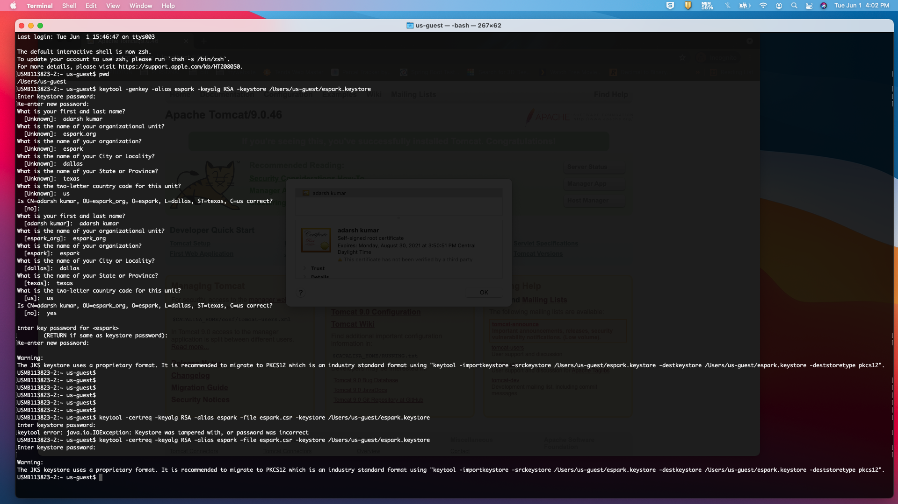
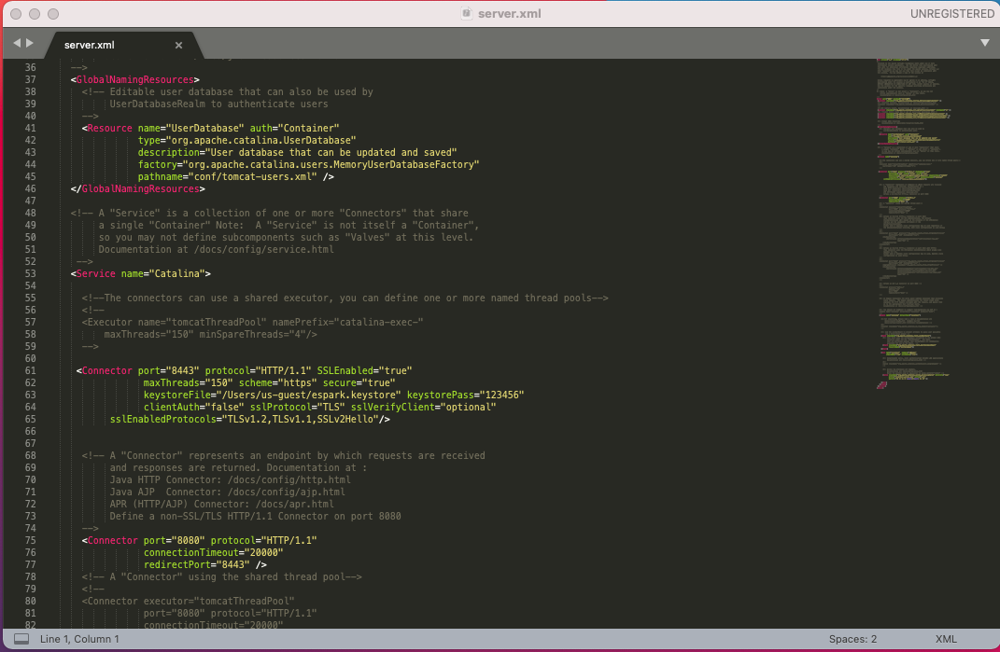
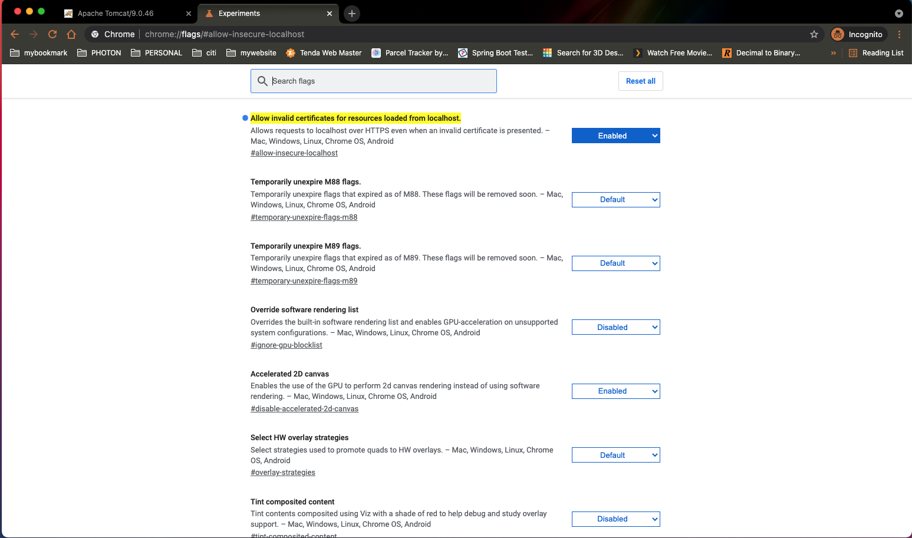
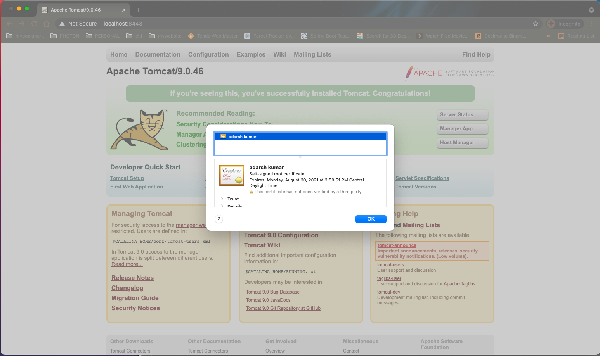

## To  Download tomcat 
* https://tomcat.apache.org/index.html
	* downloads -> version 
* for mac/linux -> tar.gz 
* for windows -> 64bitXXX.zip


### for user creation in tomcat 
* ~/TomcatXXX/conf/tomcat-users.xml


```

 <role rolename="manager-gui"/>
  <role rolename="tomcat"/>
  <role rolename="admin"/>
  <role rolename="user"/>
  <user username="tomcat" password="tomcat" roles="tomcat,manager-gui"/>
  <user username="user" password="user" roles="tomcat,admin"/>
  <user username="admin" password="admin" roles="admin"/>

```


### for deployment 
* create a war file of the application and copy it in below location 
* ~/TomcatXXX/webapps 


### for starting and stopping  
* unzip the file and go to the  ~/TomcatXXX/bin
* for start $ sh startup.sh 
* for stopping $  sh shutdown.sh


### to view the application on tomacat 
* http://localhost:8080/manager/html
* provide tomcat/tomcat 


---

# To Enable SSL or 8443 port on tomcat 

# us-guest$ pwd 
```
/Users/us-guest
```
# # Create Keystore 
```
us-guest$ keytool -genkey -alias espark -keyalg RSA -keystore /Users/us-guest/espark.keystore

Enter keystore password:  
Re-enter new password: 
What is your first and last name?
  [Unknown]:  adarsh kumar
What is the name of your organizational unit?
  [Unknown]:  espark_org
What is the name of your organization?
  [Unknown]:  espark 
What is the name of your City or Locality?
  [Unknown]:  dallas
What is the name of your State or Province?
  [Unknown]:  texas
What is the two-letter country code for this unit?
  [Unknown]:  us
Is CN=adarsh kumar, OU=espark_org, O=espark, L=dallas, ST=texas, C=us correct?
  [no]:  yes

Enter key password for <espark>
	(RETURN if same as keystore password):  123456
Re-enter new password: 123456

Warning:
The JKS keystore uses a proprietary format. It is recommended to migrate to PKCS12 which is an industry standard format using "keytool -importkeystore -srckeystore /Users/us-guest/espark.keystore -destkeystore /Users/us-guest/espark.keystore -deststoretype pkcs12".
```


# Create Self Signed Certificate Signing Request
```
us-guest$ keytool -certreq -keyalg RSA -alias espark -file espark.csr -keystore /Users/us-guest/espark.keystore
Enter keystore password:  123456

Warning:
The JKS keystore uses a proprietary format. It is recommended to migrate to PKCS12 which is an industry standard format using "keytool -importkeystore -srckeystore /Users/us-guest/espark.keystore -destkeystore /Users/us-guest/espark.keystore -deststoretype pkcs12".
````



# Update /conf/server.xml file
```
  <Connector port="8443" protocol="HTTP/1.1" SSLEnabled="true"
               maxThreads="150" scheme="https" secure="true"
               keystoreFile="/Users/us-guest/espark.keystore" keystorePass="123456"
               clientAuth="false" sslProtocol="TLS" sslVerifyClient="optional"
         sslEnabledProtocols="TLSv1.2,TLSv1.1,SSLv2Hello"/>

````



# Start Apache Tomcat.
* $ /Users/tomcat/bin/shutdown.sh
* $ /Users/tomcat/bin/startup.sh


# Check HTTPS url and certification
* https://localhost:8443


# By default Chrome Blocks all insecure HTTPS sites from loading.
* NOTE certificate in browser and our default self signed certificate should be valid for 90 days.
```
 Enable Chrome flag to load invalid certificates for resources loaded from localhost
 Go to Chrome
 Open Tab
 type: chrome://flags/#allow-insecure-localhost
 Enable flag from drop down
 Relaunch Chrome
````




# check your cert content using command keytool
$ keytool -list -keystore /Users/us-guest/espark.keystore

